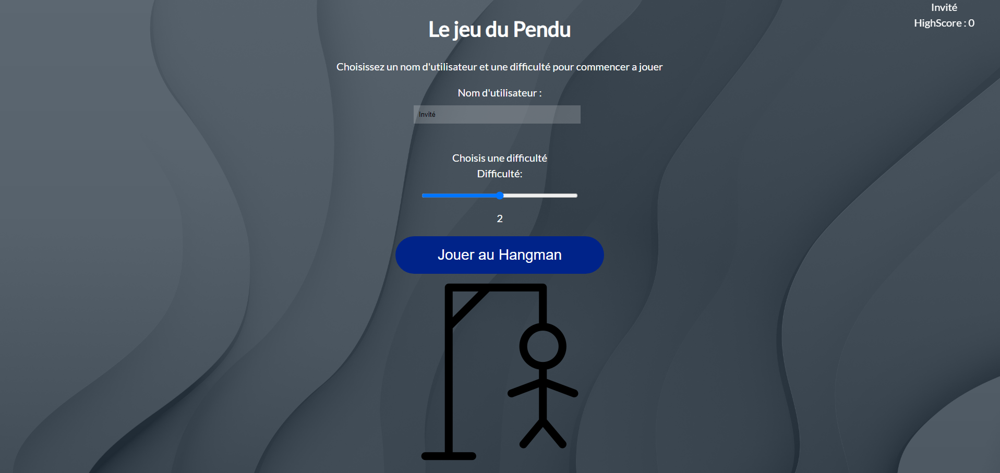
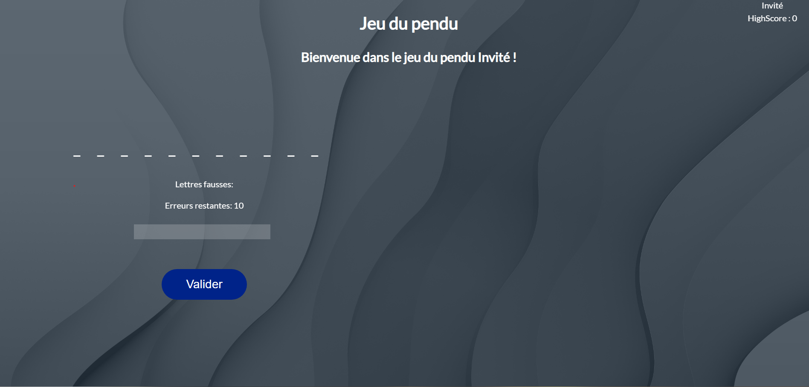
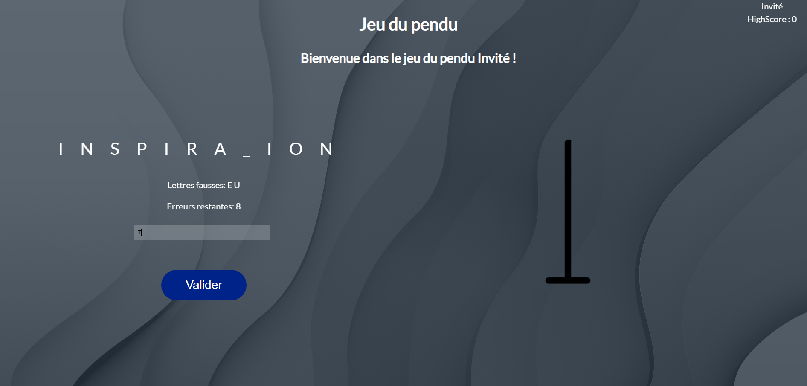
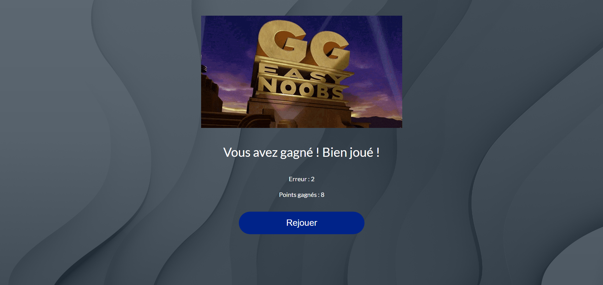
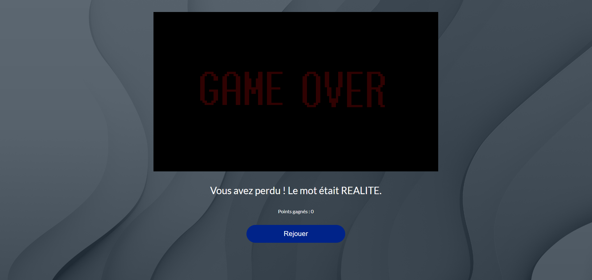

ABOUT
----------------------------------------------
This is a beginners' Golang Project. We have developed a small website that host a Hangman Game  

LANGUAGE
----------------------------------------------
- FR

TEAM
----------------------------------------------
- Gabriel D.
- Josue A.

OBJECTIVE
----------------------------------------------
- Learn Go and build a group project
- Build a Go server and an HTML/CSS webpage

PREREQUISITE
----------------------------------------------
You don't need any specific knowledge to run the code. Just run the executable file or run the code with `go run HangmanServer/main.go` and open your browser to `localhost:8080`.
To understand the code itself you will need to know the basics in html/css and Golang

RESOURCES  
----------------------------------------------
Images and Icons are from the following websites
- https://wallpapers.hector.me
- https://openai.com/dall-e-2
- https://www.flaticon.com/

Some sites that I used to learn Go and build the project
- https://golang.org/doc/
- https://www.w3schools.com/
- https://www.medium.com/
- https://openclassrooms.com/
- And of course StackOverflow and Reddit

OVERVIEW
----------------------------------------------
The project is a simple website that host a Hangman Game.
The game is a simple word guessing game. The user has to guess the word by clicking on the letters. If the letter is in the word, it will be displayed. If not, the user will lose a life. The user has 10 lives. If the user loses all his lives, he loses the game. If the user guesses the word, he wins the game.

KEYTOPICS
----------------------------------------------
- Go
- HTML
- CSS
- Web Server

PICTURES
----------------------------------------------

